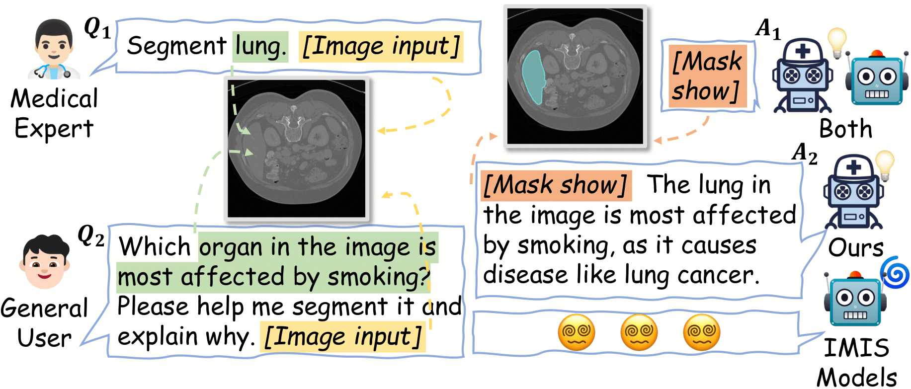

<p align="center">

  <h2 align="center">
  MediSee: Reasoning-based Pixel-level Perception in Medical Images

  </h2>
  <p align="center">
    <a><strong>Qinyue Tong</strong></a><sup>1</sup>
    ·
    <a href="https://scholar.google.com/citations?user=qx1yRVEAAAAJ&hl=zh-CN"><strong>Ziqian Lu</strong></a><sup>2</sup>
    ·
    <a><strong>Jun Liu</strong></a><sup>1</sup>
    <br>
    <a href="https://person.zju.edu.cn/zymsun2002"><strong>Yangming Zheng</strong></a><sup>1</sup>
    ·
    <a href="https://person.zju.edu.cn/lzmhome"><strong>Zhe-ming Lu</strong></a><sup>1</sup>
    <!-- <br> -->
    <br>
    <sup>1</sup>Zhejiang University, <sup>2</sup>Zhejiang Sci-Tech University
    <br>
    <div align="center">
    <a href="http://arxiv.org/abs/2504.11008"></a>
    </div>
  </p>
</p>
  


## 📣 News
* **[2025/7/6]**  Our **Medisee** has been accepted by ACM Multimedia 2025!
* **[2025/4/25]**  **Video demo** :camera: is live now!
* **[2025/4/24]**  We’ve uploaded our paper *MediSee: Reasoning-based Pixel-level Perception in Medical Images* to arXiv and set up this repository! Welcome to **watch** 👀 this repository for the latest updates.
  
## :camera: Video Demo 


## :v: Code Is Coming Soon


## :clap: Acknowledgements
This project is developed on the codebase of [LISA](https://github.com/dvlab-research/LISA) and data from [SA-Med2D-20M Dataset](https://github.com/OpenGVLab/SAM-Med2D). We appreciate their valuable contributions! 

## :love_you_gesture: Citation
If you find our paper is helpful for your research, please consider citing:
```BibTeX
@article{tong2025medisee,
  title={MediSee: Reasoning-based Pixel-level Perception in Medical Images},
  author={Tong, Qinyue and Lu, Ziqian and Liu, Jun and Zheng, Yangming and Lu, Zheming},
  journal={arXiv preprint arXiv:2504.11008},
  year={2025}
}
```
