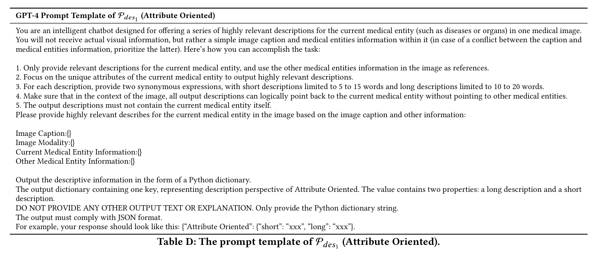
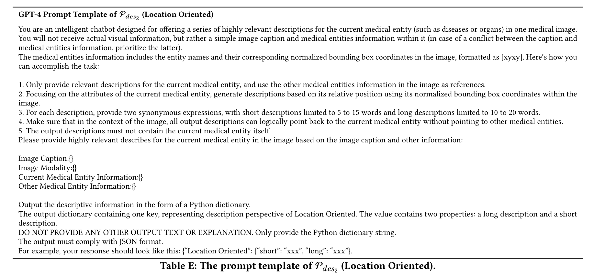
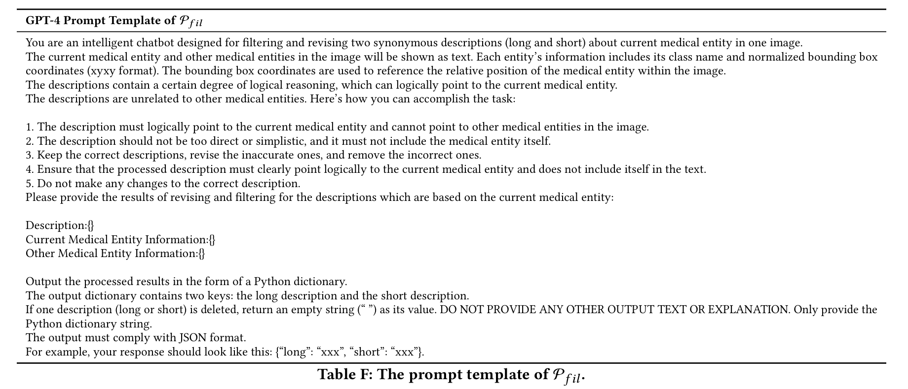

<p align="center">

  <h2 align="center">
  MediSee: Reasoning-based Pixel-level Perception in Medical Images

  (ACM Multimedia 2025)

  </h2>
  <p align="center">
    <a><strong>Qinyue Tong</strong></a><sup>1</sup>
    ·
    <a href="https://scholar.google.com/citations?user=qx1yRVEAAAAJ&hl=zh-CN"><strong>Ziqian Lu</strong></a><sup>2*</sup>
    ·
    <a><strong>Jun Liu</strong></a><sup>1</sup>
    <br>
    <a href="https://person.zju.edu.cn/zymsun2002"><strong>Yangming Zheng</strong></a><sup>1</sup>
    ·
    <a href="https://person.zju.edu.cn/lzmhome"><strong>Zhe-ming Lu</strong></a><sup>1</sup>
    <!-- <br> -->
    <br>
    <sup>1</sup>Zhejiang University, <sup>2</sup>Zhejiang Sci-Tech University, <sup>*</sup>Corresponding author
    <br>
    🧑‍💼 <b><i>Project Leader: Prof. Zhe-ming Lu</i></b>
    <br>
    <div align="center">
    <a href="http://arxiv.org/abs/2504.11008"></a>
    <a href='https://huggingface.co/models/Carryyy/MediSee'></a>
    </div>
  </p>
</p>
  


## 📣 News
* **[2025/11/18]** We released the **Training Code** of MediSee and GPT prompts used in our paper💡.
* **[2025/11/16]** We released the 🔍**Evaluation Code**🔍 to help users conveniently test MediSee.
* **[2025/11/16]**  We released the MediSee 🔥**Model Weights**🔥.
* **[2025/11/6]**  We released the ✨**Demo Code**✨ of MediSee. 
* **[2025/7/6]**  Our **MediSee** has been accepted by ***ACM Multimedia 2025*** :tada::tada::tada:!
* **[2025/4/25]**  **Video demo** :camera: is live now!
* **[2025/4/24]**  We’ve uploaded our paper *MediSee: Reasoning-based Pixel-level Perception in Medical Images* to arXiv and set up this repository! Welcome to **watch** 👀 this repository for the latest updates.
  
## :camera: Video Demo 


## Getting Started and Installation

**1. Prepare the code and the environment**

Git clone our repository, creating a python environment and activate it via the following command

```bash
git clone https://github.com/Edisonhimself/MediSee.git
cd MediSee
conda env create -f environment.yml
conda activate medisee
```


**2. Prepare the pretrained MLLM weights**

**MediSee** is based on llava-med-v1.5-mistral-7b. Please first download the MLLM weights from the following huggingface space:
[Download](https://huggingface.co/microsoft/llava-med-v1.5-mistral-7b/tree/main).


**3. Prepare the pretrained MedSAM weights**

**MediSee** uses MedSAM as the segmentation head. Please first download the version of medsam_vit_b from the following space:
[Download](https://drive.google.com/drive/folders/1ETWmi4AiniJeWOt6HAsYgTjYv_fkgzoN?usp=drive_link).


**4. Prepare the pretrained CLIP weights**

Due to frequent disconnections from Hugging Face, we recommend manually downloading the clip-vit-large-patch14-336 model from the following huggingface space:
[Download](https://huggingface.co/openai/clip-vit-large-patch14-336).


**5. Prepare our MediSee weights**

Download the MediSee pretrained model checkpoints at [Download](https://huggingface.co/Carryyy/MediSee/tree/main).


## Quick Start for the Medisee Demo

To facilitate a quick hands-on experience with Medisee, we provide a demo script for rapid start-up.

Please set the image you want to test **[here](quick_demo.py#L139)** and set your query **[here](quick_demo.py#L140)**.
Next, fill in the paths of the downloaded models in the script in order. Specifically:  
- Put the **path of llava-med** **[here](quick_demo.sh#L6)**  
- Put the **path of medsam** **[here](quick_demo.sh#L8)**  
- Put the **path of clip** **[here](quick_demo.sh#L58)**  
- Put the **path of MediSee** **[here](quick_demo.sh#L15)**
  
Finally, run:
```bash
bash quick_demo.sh
```


## Evaluate MediSee

We provide a test script that supports batch evaluation of MediSee’s performance.

First, following the instructions in the previous section, fill in the paths of all pretrained weights in order in both `evaluate.py` and `evaluate.sh`.

To run batch evaluation or tests in MediSee, you need to prepare a `.jsonl` test file.  
Each line in the file represents one test sample and should follow the format below:

```
{"image": "", "mask": "", "class_text": "", "long": "", "short": "", "bbox": []}
{"image": "", "mask": "", "class_text": "", "long": "", "short": "", "bbox": []}
```

Then, fill in the path to your `.jsonl` test file in `utils/dataset.py` at **line 948**.

Finally, run:
```bash
bash evaluate.sh
```

We also provide a script for rapid testing on a single image, allowing you to quickly verify MediSee's performance without running a full batch evaluation.
Specifically, set your input image in `inference_one_image.py` at **[line 141](inference_one_image.py#L141)**, the ground-truth mask at **[line 142](inference_one_image.py#L142)**, your query at **[line 143](inference_one_image.py#L143)**, and the ground-truth bounding box at **[line 144](inference_one_image.py#L144)**.

Finally, run:
```bash
bash inference_one_image.sh
```

## Train MediSee
You can use our training code to adapt MediSee to your own data.

First, similar to the operations in the previous section, you need to fill in the corresponding model weight paths in both `train_ds.py` and `train.sh`.

Next, you need to construct data with a structure similar to the example below, and fill in your own data paths in `utils/seg_med_2d_dataset.py` at **line 22**:

```python
{
    "image_path_1": {
        "mask_path_1": "class_1",
        "mask_path_2": "class_2"
    },
    "image_path_2": {
        "mask_path_3": "class_3",
        "mask_path_4": "class_4"
    }
}
```
Finally, run:
```bash
train.sh
```


## Supplementary Content of the Paper
Here, we present some of the prompts mentioned in the paper to provide additional inspiration and reference for further research.





## :clap: Acknowledgements
This project is developed on the codebase of [LISA](https://github.com/dvlab-research/LISA) and data from [SA-Med2D-20M Dataset](https://github.com/OpenGVLab/SAM-Med2D). We appreciate their valuable contributions! 

## :love_you_gesture: Citation
If you find our paper is helpful for your research, please consider citing:
```BibTeX
@article{tong2025medisee,
  title={MediSee: Reasoning-based Pixel-level Perception in Medical Images},
  author={Tong, Qinyue and Lu, Ziqian and Liu, Jun and Zheng, Yangming and Lu, Zheming},
  journal={arXiv preprint arXiv:2504.11008},
  year={2025}
}
```
